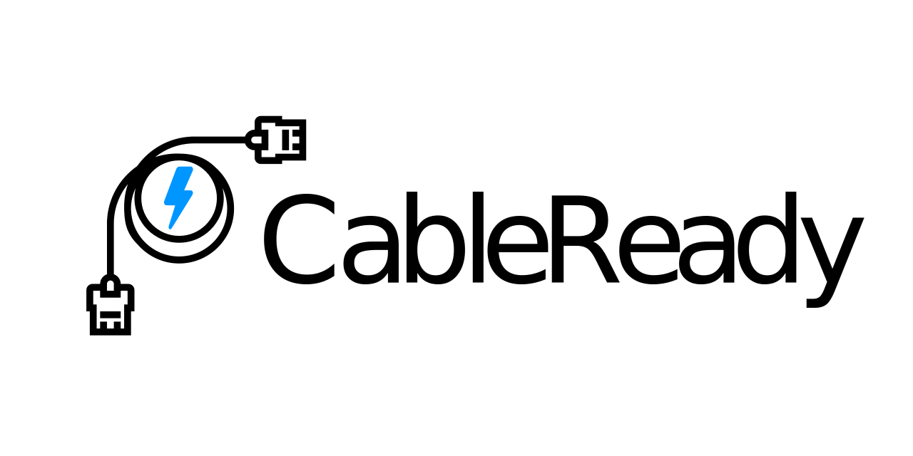

<p align="center">
  
  <h1 align="center">Welcome to CableReady 👋</h1>
  <p align="center">
    
    
    <a href="https://www.npmjs.com/package/cable_ready">
      
    </a>
    <a href="https://github.com/hopsoft/cable_ready/blob/master/LICENSE">
      
    </a>
    <a href="http://blog.codinghorror.com/the-best-code-is-no-code-at-all/" target="_blank">
      
    </a>
    <a href="https://cableready.stimulusreflex.com" target="_blank">
      
    </a>
    <br />
    <a href="#badge">
      
    </a>
    <a href="https://github.com/testdouble/standard" target="_blank">
      
    </a>
    <a href="https://github.com/sheerun/prettier-standard" target="_blank">
      
    </a>
    <br />
    <a href="https://codeclimate.com/github/hopsoft/cable_ready/maintainability" target="_blank">
      
    </a>
    <a target="_blank" rel="noopener noreferrer" href="https://github.com/hopsoft/cable_ready/workflows/Prettier-Standard/badge.svg">
      
    </a>
    <a target="_blank" rel="noopener noreferrer" href="https://github.com/hopsoft/cable_ready/workflows/StandardRB/badge.svg">
      
    </a>
  </p>
</p>
<br />

CableReady helps you create great real-time user experiences by making it simple to trigger client-side DOM changes from server-side Ruby. It establishes a standard for interacting with the client via ActionCable web sockets. No need for custom JavaScript.

Please read the official [ActionCable docs](http://guides.rubyonrails.org/action_cable_overview.html)
to learn more about ActionCable before proceeding.

## 📚 Docs

- [Official Documentation](https://cableready.stimulusreflex.com)
- [Documentation Source Code](https://github.com/hopsoft/cable_ready/tree/master/docs)

## 💙 Community

- [Discord](https://discord.gg/XveN625) - chat root

## 🚀 Install

```sh
bundle add cable_ready && yarn add cable_ready
```

Checkout the [documentation](https://cableready.stimulusreflex.com) to continue!


## 🙏 Contributing

### Code of Conduct

Everyone interacting with CableReady is expected to follow the [Code of Conduct](CODE_OF_CONDUCT.md)

### Coding Standards

This project uses [Standard](https://github.com/testdouble/standard)
and [prettier-standard](https://github.com/sheerun/prettier-standard) to minimize bike shedding related to code formatting.

Please run `./bin/standardize` prior submitting pull requests.

### 📦 Releasing

1. Bump version number at `lib/cable_ready/version.rb`
1. Run `rake build`
1. Run `rake release`
1. Change directories `cd ./javascript`
1. Run `yarn publish` - NOTE: this will throw a fatal error because the tag already exists but the package will still publish

## 📝 License

CableReady is released under the [MIT License](LICENSE.txt).
